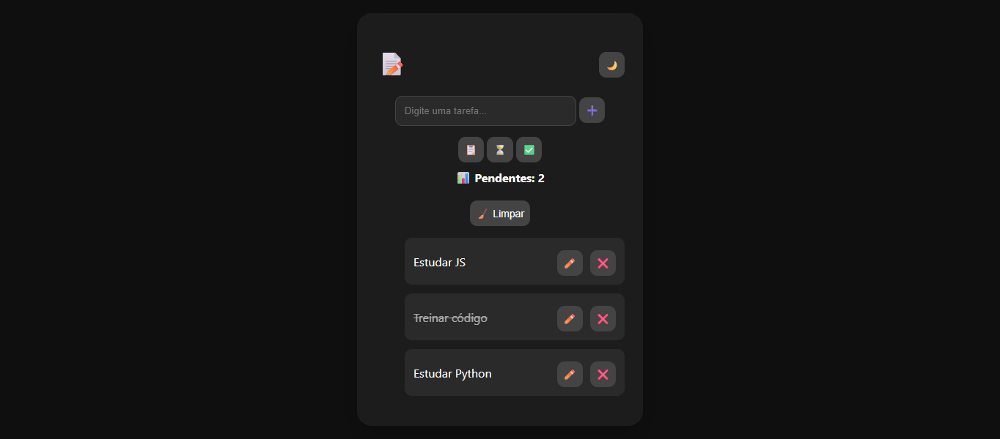

📝 To-Do List

«Aplicação web moderna de lista de tarefas, com foco em produtividade e experiência do usuário.»

---

🚀 Funcionalidades

- ➕ Adicionar tarefas
- ✏️ Editar tarefas
- ❌ Excluir tarefas
- ✅ Marcar como concluída
- 🌙 Modo escuro (com salvamento automático)
- 🔎 Filtro de tarefas (todas, pendentes, concluídas)
- 📊 Contador de tarefas pendentes

---

🎨 Preview

---

🛠️ Tecnologias utilizadas

- HTML5
- CSS3
- JavaScript

---

🌐 Acesse o projeto

👉 https://williamggt095-gif.github.io/todo-list

---

📦 Como usar

Clone o repositório:

git clone https://github.com/williamggt095-gif/todo-list.git

Abra o arquivo:

index.html

---

📚 Aprendizados

Este projeto me ajudou a desenvolver habilidades em:

- Manipulação do DOM
- Eventos em JavaScript
- Uso de LocalStorage
- Organização de código
- Criação de interfaces interativas

---

👨‍💻 Autor

Feito por William Gabriel 🚀
